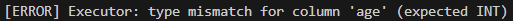

# C SQL Engine

> C 언어로 구현한 파일 기반 SQL 처리기

---

## 프로젝트 개요

- 대상: `members` 테이블
- 목적: SQL 문장 직접 해석 및 실행
- 지원 범위: `INSERT`, `SELECT`
- 저장 방식: `.schema`, `.tbl`


## 핵심 데이터 구조

- 기준 도메인: `members`
- 핵심 구조체: `Token`, `Statement`, `MemberRecord`

```c
typedef struct {
    TokenType type;
    char value[MAX_TOKEN_LEN];
    int line;
} Token;

typedef struct {
    StatementType type;
    char table_name[MAX_IDENTIFIER_LEN];
    ColumnList select_columns;
    WhereClause where;
    ColumnList insert_columns;
    char values[MAX_COLUMNS][MAX_TOKEN_LEN];
    int value_is_null[MAX_COLUMNS];
    int value_count;
} Statement;

typedef struct {
    int32_t id;
    char name[MAX_NAME_LEN];
    char grade[MAX_GRADE_LEN];
    char class[MAX_CLASS_LEN];
    int32_t age;
} MemberRecord;
```

- `Token`: SQL 최소 단위
- `Statement`: Parser 결과 구조
- `MemberRecord`: `members` 테이블 기준 레코드
- 문자열 길이 기준: `MAX_NAME_LEN`, `MAX_GRADE_LEN`, `MAX_CLASS_LEN`

---

## SQL 처리 파이프라인

- 입력 방식: `-f`, `-e`
- 문장 분리: 세미콜론 기준
- 예외 처리: 문자열 내부 세미콜론, `--` 주석 제외

```text
SQL 입력
  -> tokenize()
  -> parse()
  -> execute()
      -> schema_load()
      -> storage_insert() / storage_select()
```

### 실행 단계

| 단계 | 함수 | 역할 |
|------|------|------|
| 입력 분해 | `tokenize()` | SQL 문자열 → Token 배열 |
| 문법 해석 | `parse()` | Token 배열 → Statement |
| 실행 분기 | `execute()` | INSERT / SELECT 분기 실행 |
| 스키마 검증 | `schema_load()` | `schemas/{table}.schema` 로드 |
| 파일 저장/조회 | `storage_insert()`, `storage_select()` | `.tbl` 저장 및 조회 |

## 주요 쟁점

### 1. 키워드 대소문자 처리 vs 식별자 정규화

- 키워드 처리: 대소문자 무시
- 식별자 처리: 소문자 정규화
- 목적: Parser / Schema / Storage 비교 로직 단순화

### 2. WHERE 처리 방식 — 평면 조건 배열

- 저장 방식: `Condition[] + logical_op`
- 장점: 구현 단순화

```c
typedef struct {
    Condition conditions[MAX_CONDITIONS];
    int condition_count;
    char logical_op[4];
} WhereClause;
```

### 3. 파일 기반 저장 방식

- 저장 포맷: 파이프(`|`) 구분 텍스트
- 장점: 구조 확인 쉬움

```text
id|name|grade|class|age
1|Alice|vip|advanced|30
2|Bob|normal|basic|22
```

### 4. Executor 중심 검증 로직

- 검증 항목:
  - 컬럼 수 / 값 수 일치
  - 존재하지 않는 컬럼명
  - 중복 컬럼
  - 타입 검증
  - VARCHAR 길이 초과
  - NULL 허용 여부
  - 기본키 중복
  - 저장 불가 문자 포함 여부

- 역할:
  - 입력 검증
  - 데이터 무결성 보장
  - storage 호출 전 최종 방어선

### 5. 아키텍처 비교 — 우리 프로젝트 vs MySQL vs SQLite

| 항목        | 우리 프로젝트            | MySQL                         | SQLite                                   |
| --------- | ------------------ | ----------------------------- | ---------------------------------------- |
| 목표        | SQL 처리 흐름 학습용 | 범용 서버형 RDBMS                  | 임베디드 파일 기반 DB                            |
| 실행 형태     | 단일 CLI 프로그램        | 클라이언트-서버 구조                   | 라이브러리 + CLI                              |
| SQL 처리 단계 | CLI -> Lexer -> Parser -> Executor    | Parser → Optimizer → Executor → Engine| Parser → Query Planner → Virtual Machine |
| 쿼리 최적화    | 없음                 | 있음 (인덱스, 실행계획)                | 있음 (경량 Planner)                          |
| 실행 방식     | 직접 파일 읽기/쓰기        | Storage Engine (InnoDB 등)     | VDBE(가상머신)로 실행                           |
| 저장 구조     | 단순 텍스트 파일 (.tbl)   | 페이지 기반 디스크 저장                 | 단일 파일 + B-tree 구조                        |
| 동시성 처리    | 없음                 | 트랜잭션 / 락 지원                   | 제한적 트랜잭션                                 |
| 지원 SQL    | INSERT, SELECT     | 대부분 SQL                       | 대부분 SQL                                  |

---

## 테스트케이스 및 엣지케이스

- 테스트 구성: 모듈별 단위 테스트
- 포함 범위: Lexer, Parser, Schema, Storage, Executor, CLI

**기본 테스트** — 핵심 동작 검증

| 구분 | 케이스 |
|------|--------|
| Lexer | 빈 입력, 대소문자 무시, 문자열 이스케이프, 주석 처리 |
| Parser | `SELECT *`, WHERE AND, INSERT NULL 값, FROM 누락 오류 |
| Schema | members 스키마 로드, 컬럼 조회, 타입 파싱 |
| Storage | 첫 INSERT 시 헤더 생성, WHERE 기반 필터링 |
| Executor | PK 중복 차단, VARCHAR 길이 초과 차단, 잘못된 SELECT 컬럼 차단 |
| CLI | `-e`, `-f` 실행, 파싱 오류 종료 코드 확인 |

**엣지 케이스** — 경계 상황 검증

| 구분 | 케이스 |
|------|--------|
| NULL 처리 | nullable 컬럼에서만 허용 |
| WHERE 제약 | 하나의 WHERE 절에서 AND/OR 혼합 불가 |
| 저장 제약 | `|`, 개행 문자가 포함된 값 저장 불가 |
| 타입 검증 | INT, FLOAT, DATE 형식 검사 |
| 빈 테이블 조회 | 데이터 파일이 없어도 빈 결과 반환 |

---

## INSERT INT 오버플로 통과 에러

`INSERT` 문 처리 과정에서 `INT` 컬럼에 대해 숫자 형식만 확인하고, 실제 `int32_t` 범위 초과 여부는 검사하지 않아 오버플로 값이 그대로 저장되는 문제가 있었습니다.

- 증상: `999999999999999999999` 같은 `INT` 범위 초과 값이 에러 없이 저장됨
- 원인: `strtol` 결과를 사용하더라도 `INT32_MIN ~ INT32_MAX` 범위 검증이 빠져 있었음


오버플로 값 입력 쿼리:

문제 재현 쿼리:

```sql
INSERT INTO members (id, name, grade, class, age) VALUES (31, '테스트', 'normal', 'basic', 999999999999999999999);
```

수정 전 결과:

- 기대 동작: 타입 불일치 에러 발생
- 실제 동작: `1 row inserted.` 출력 후 row 저장


