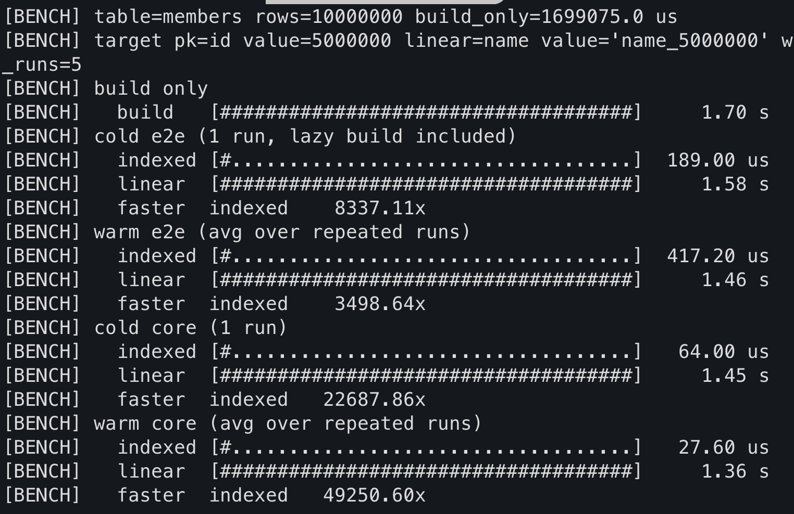
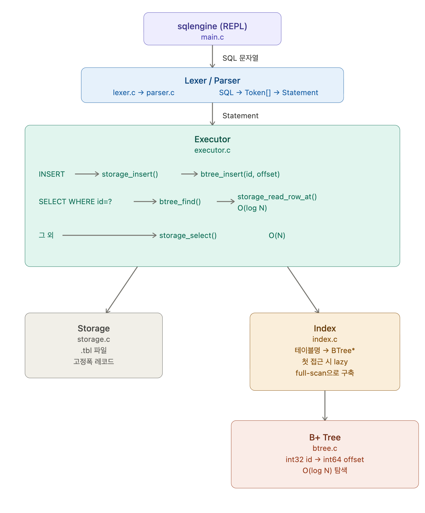
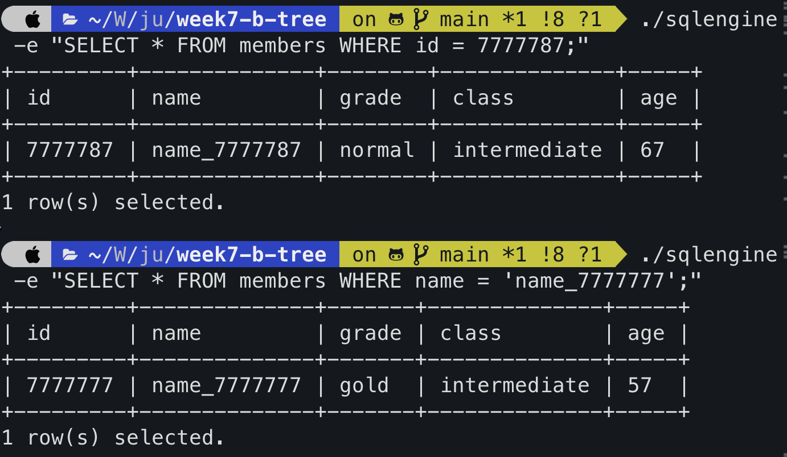
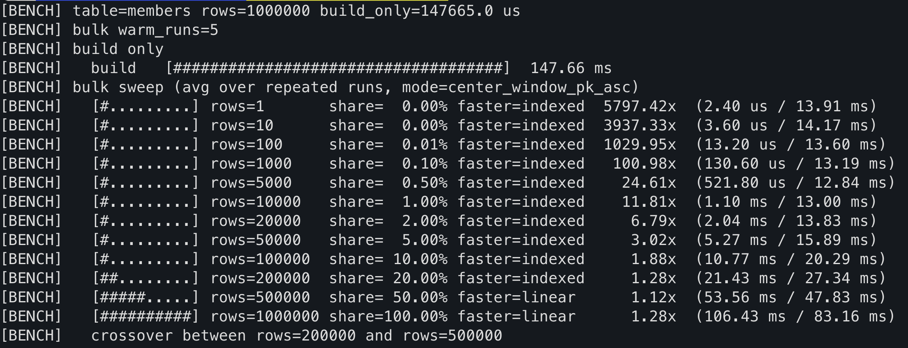

# week7-b-tree

> Jungle 12기 7주차 — C로 만든 파일 기반 SQL 엔진에 **메모리 B+ 트리 인덱스**를 직접 얹어,  
> `WHERE id = ?` 조회를 O(N) 선형 탐색에서 O(log N) 인덱스 탐색으로 바꾸는 프로젝트.

---



---

## 왜 이 프로젝트를 만들었는지

"인덱스를 쓰면 빠르다"는 말은 수도 없이 들었지만,  
**얼마나 빠른지, 왜 빠른지** 직접 숫자로 확인한 적은 없었다.

6주차에서 파일 기반 SQL 엔진을 직접 구현하면서 문제가 보였다.  
`WHERE id = ?` 쿼리가 레코드 수만큼 파일을 통째로 읽는다.  
100만 건이 쌓이면 한 번의 조회에도 전체를 다 탐색한다.

그래서 7주차 목표는 단순하다.  
**같은 SQL 엔진 위에 B+ 트리 인덱스를 직접 얹고, 속도 차이를 숫자로 확인한다.**

교과서 그림이 아니라, 내 손으로 짠 코드로 O(N) vs O(log N)을 재보는 것.

---

## 왜 B+ Tree를 구현하는가

### 핵심 의도

B+ Tree는 **실제 DBMS의 핵심 자료구조**다.  
MySQL InnoDB, PostgreSQL, Oracle 모두 기본 인덱스로 B+ Tree를 사용한다.

구현을 통해 배우는 것:
- **디스크 I/O 최소화 원리** 이해
- **트리의 균형**이 왜 쿼리 성능에 직결되는지 체감
- **실제 DB 엔진이 어떻게 동작하는지** 저수준부터 이해

### B+ Tree가 선택된 이유 (다른 자료구조 대비)

| 자료구조 | 탐색 | 범위 탐색 | 디스크 친화성 | DBMS 사용 |
|---|---|---|---|---|
| Binary Search Tree | O(log n) | 복잡 | X | X |
| Hash Table | O(1) | X | X | 제한적 |
| B Tree | O(log n) | 비효율 | O | 일부 |
| **B+ Tree** | **O(log n)** | **리프연결** | O | **주류** |

B Tree 대비 B+ Tree의 결정적 차이는 **리프 노드가 Linked List로 연결**되어 있다는 점이다.  
`WHERE id BETWEEN 100 AND 200` 같은 범위 쿼리가 리프만 순회하면 되기 때문에 압도적으로 효율적이다.

---

## 프로젝트 핵심

이 프로젝트의 핵심은 **B+ 트리가 SQL 엔진 내부에 어떻게 연결되는가**다.

```
INSERT 할 때마다    →  id와 파일 오프셋을 B+ 트리에 등록
WHERE id = ? 할 때 →  B+ 트리로 오프셋을 찾아 그 위치만 읽기
```

인덱스 없음: `storage_select()`가 `.tbl` 파일을 처음부터 끝까지 읽는다 **(O(N))**  
인덱스 있음: `btree_find()`로 파일 오프셋을 꺼내 `storage_read_row_at()`으로 한 줄만 읽는다 **(O(log N))**

### 실측 결과 (100만 건 기준)

```
[BENCH] warm core (avg over repeated runs)
  indexed  49.00 us
  linear   145.97 ms
  speedup  2978.89x
```

### 핵심 설계 결정

| 결정 | 이유 |
|------|------|
| **warm cache 는 메모리에 둔다** | 질의 중에는 B+ 트리를 재사용해 O(log N) 탐색을 유지 |
| **인덱스는 lazy build + `.idx` persist** | 첫 조회 시점에 `.tbl` 풀스캔 1회로 구축하고, 이후 `.idx` 재사용/복구까지 지원 |
| **기존 인터페이스 최소 변경** | `storage_insert()`에 `out_offset` 파라미터만 추가, 6주차 코드 거의 그대로 유지 |

---

## 빠른 시작

```bash
# 빌드
make
make tools

# 100만 건 데이터 생성 (~3초)
./tools/gen_members 1000000

# 인덱스 vs 선형 벤치마크
./sqlengine --bench members --runs 5

# REPL로 직접 체감
./sqlengine -e "SELECT * FROM members WHERE id = 777777;"        # O(log N) — 즉시
./sqlengine -e "SELECT * FROM members WHERE name = 'name_0777777';"  # O(N) — 지연 체감
```

자세한 사용법은 [USAGE.md](USAGE.md)를 참고한다.

---

## 빌드

```bash
make            # sqlengine 빌드 (릴리스, -O2)
make debug      # 디버그 빌드 (-g -DDEBUG)
make tools      # tools/gen_members 빌드
make test       # 전체 유닛/통합 테스트 실행
make clean      # 빌드 아티팩트 정리
```

**요구사항**: gcc, C99, POSIX 환경 (Linux / macOS)

---

## 아키텍처

### 전체 처리 흐름



### 모듈 역할 요약

| 모듈 | 파일 | 역할 |
|------|------|------|
| **Lexer** | `lexer.c` | SQL 문자열 → Token 스트림 |
| **Parser** | `parser.c` | Token 스트림 → `Statement` 구조체 |
| **Executor** | `executor.c` | `Statement` → INSERT/SELECT 실행, auto-increment, PK 중복 검사 |
| **Storage** | `storage.c` | `.tbl` 파일 읽기·쓰기, 파일 오프셋 반환 |
| **Schema** | `schema.c` | `.schema` 파일 파싱 및 `Schema` 구조체 로드 |
| **BTree** | `btree.c` | 메모리 기반 B+ 트리 (`int32 id → int64 offset`) |
| **Index** | `index.c` | 테이블명 → BTree 캐시 + persisted `.idx`, stale/corrupt 시 재빌드 |
| **Config** | `config.c` | 데이터·스키마 디렉토리 경로 등 전역 설정 |

### INSERT 흐름

```
INSERT 문
  └─► execute_insert()
        ├─► auto_assign_pk()          ← id 미지정 시 btree_max_key + 1
        ├─► storage_insert(&offset)   ← .tbl 에 레코드 append, 파일 오프셋 반환
        └─► index_record_insert(id, offset) ← 캐시 갱신 + `.idx` 동기화
```

### SELECT (WHERE id = ?) 흐름

```
SELECT ... WHERE id = N
  └─► execute_select()
        └─► try_index_select()
              ├─► index_lookup_offset()      ← 캐시 / `.idx` / `.tbl` 재빌드 경로 선택
              ├─► btree_find(N) 또는 `.idx` 이진 탐색 → 파일 오프셋
              └─► storage_read_row_at(offset) ← 해당 위치 단일 행만 읽기
```



---

## 디렉토리 구조

```
week7-b-tree/
├── src/                        # SQL 엔진 소스
│   ├── main.c                  # 진입점 · REPL · --bench CLI
│   ├── types.h                 # 공용 타입 정의 (Token, Statement, Schema, Row …)
│   ├── lexer.c / lexer.h       # 어휘 분석 — SQL 문자열 → Token 스트림
│   ├── parser.c / parser.h     # 구문 분석 — Token 스트림 → Statement
│   ├── executor.c / executor.h # 실행기 — auto-increment · PK 중복 검사 · 인덱스 SELECT
│   ├── storage.c / storage.h   # 파일 기반 스토리지 (.tbl 고정폭 레코드)
│   ├── schema.c / schema.h     # 스키마 파일 로드 · 관리
│   ├── config.c / config.h     # 데이터 경로 등 전역 설정
│   ├── btree.c / btree.h       # 메모리 기반 B+ 트리 (order 64, leaf 연결 리스트)
│   └── index.c / index.h       # 인덱스 캐시 + persisted `.idx` 관리
├── tests/                      # 유닛·통합 테스트 (프레임워크 없이 순수 C)
│   ├── test_btree.c            # B+ 트리 — 삽입/조회/split 경계 등 7케이스
│   ├── test_index_integration.c# 인덱스 통합 — auto-increment · lazy build · 실제 조회 일치
│   ├── test_index_persistence.c# persisted `.idx` — 생성 · 손상 복구 · stale 감지
│   ├── test_executor.c         # 실행기 테스트
│   ├── test_storage.c          # 스토리지 테스트
│   ├── test_lexer.c            # 어휘 분석기 테스트
│   ├── test_parser.c           # 파서 테스트
│   ├── test_schema.c           # 스키마 테스트
│   ├── test_cli.c              # CLI E2E 테스트
│   └── test_helpers.h          # 공용 테스트 유틸리티
├── tools/
│   └── gen_members.c           # 대량 레코드 생성기 (tbl 직접 기록 / SQL 모드)
├── sql/                        # 예제 SQL 스크립트
│   ├── members_30.sql
│   └── members_demo.sql
├── schemas/                    # 테이블 스키마 정의 파일
│   └── members.schema
├── data/                       # 런타임 데이터 (자동 생성)
│   └── members.tbl
├── assets/                     # 문서 이미지 · 다이어그램
├── build/                      # 컴파일 아티팩트 (자동 생성)
├── Makefile
├── README.md
├── USAGE.md                    # 상세 사용법 · 벤치마크 · 트러블슈팅
└── API_SPEC.md                 # 모듈별 함수 인터페이스 명세
```

---

## 현재 제약사항

- **warm cache 는 메모리 기반**: 프로세스 종료 시 트리는 사라지지만, 다음 실행에서 `.idx` 또는 `.tbl` 기준으로 다시 복구
- **INT PK 전용**: 다른 타입의 PK는 인덱싱하지 않음
- **단일 동등 WHERE만 최적화**: `WHERE id = K` 한정. `BETWEEN`, `>=` 등은 선형 스캔
- **ResultSet 상한**: 풀스캔 결과가 10,000건을 넘으면 잘림 (단일 매치 조회에는 무관)



---

## 로드맵

- [x] 6주차 SQL 엔진 이식 및 빌드·테스트 확인
- [x] B+ 트리 모듈 구현 + 유닛 테스트
- [x] INSERT 시 인덱스 자동 등록 (auto-increment · storage/executor 연동)
- [x] `WHERE id = ?` 경로에서 인덱스 탐색 사용
- [x] 100만+ 레코드 생성기 및 벤치마크 스크립트
- [ ] 인덱스 사용 vs 선형 탐색 성능 비교 리포트 (공식 문서화)
- [ ] 추가 차별화 요소 (범위 검색, 복합 인덱스 등 검토)
